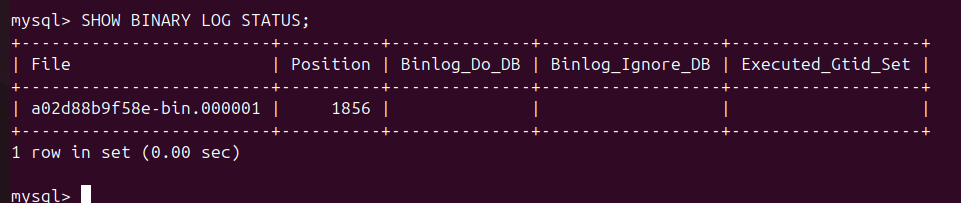
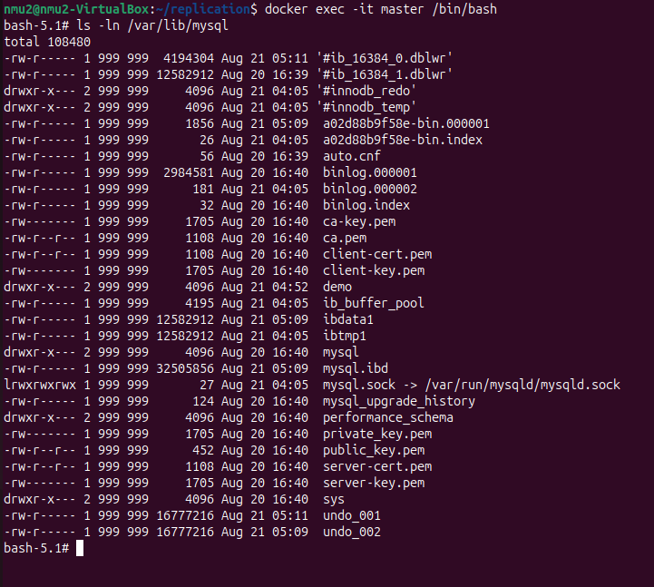
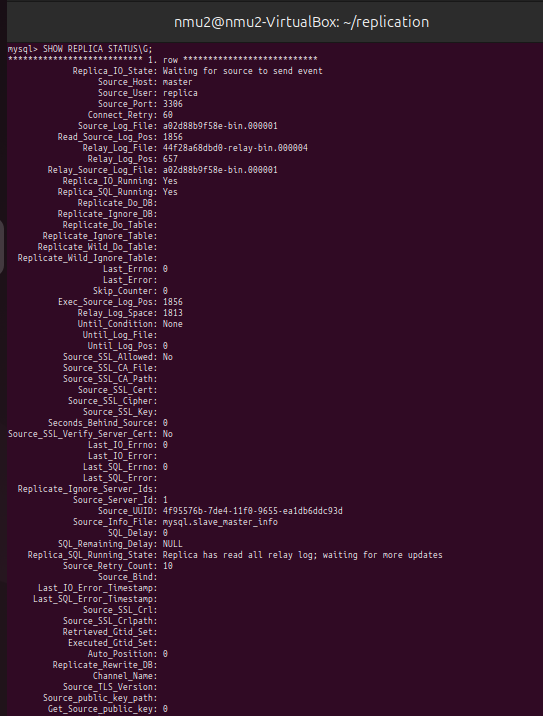
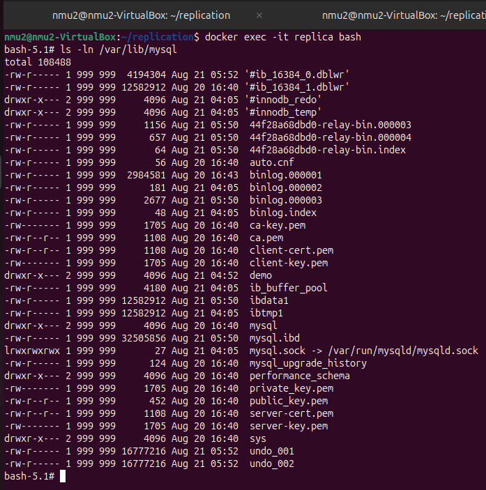

# Домашнее задание к занятию «Репликация и масштабирование. Часть 1»
### Задание 1

На лекции рассматривались режимы репликации master-slave, master-master, опишите их различия.

*Ответить в свободной форме.*

### Ответ:
Режимы репликации master-slave и master-master отличаются подходом к организации базы данных. Эти режимы используются для автоматического копирования и синхронизации данных между несколькими серверами (узлами). 

#### Master-slave
Принцип работы: одна ведущая реплика (master) отвечает за все операции записи (вставки, обновления, удаления), а несколько ведомых реплик (slave) получают копии этих изменений и служат для чтения данных. 

Особенности:
Master автоматически передаёт изменения slave.
Клиенты могут читать данные как с master, так и с slave (чаще — со slave, чтобы снизить нагрузку на master).
 
Преимущества:
разгрузка master — чтение можно распределить по нескольким slave, что повышает производительность;
резервирование — если master сломается, можно переключиться на один из slave;
масштабируемость — можно добавлять новые slave без перегрузки основного сервера.
 
Недостатки:
задержка синхронизации — данные на slave могут немного отставать от master;
если master падает, вручную или с помощью дополнительных механизмов нужно выбрать нового;
не подходит для интенсивной записи — так как записи идут только в один узел, он может стать узким местом.
 
#### Master-master
Принцип работы: у базы данных есть два (или больше) главных сервера, и каждый из них может одновременно принимать и обрабатывать запросы на запись и чтение. Данные между серверами автоматически синхронизируются, чтобы оставаться одинаковыми. 

Особенности:
высокая отказоустойчивость — если один сервер выходит из строя, другой продолжает работать;
балансировка нагрузки — можно распределять запросы между серверами, снижая нагрузку на каждый из них;
быстрее для географически распределённых систем — пользователи могут работать с ближайшим сервером, уменьшая задержки.
 
Недостатки:
конфликты данных — если два сервера изменяют одни и те же данные одновременно, могут возникнуть проблемы с их синхронизацией;
сложность настройки и поддержки — требуется механизм разрешения конфликтов и контроль синхронизации;
задержки репликации — хотя данные синхронизируются, это не всегда происходит мгновенно, что может привести к временным рассинхронизациям.
---

### Задание 2

Выполните конфигурацию master-slave репликации, примером можно пользоваться из лекции.

*Приложите скриншоты конфигурации, выполнения работы: состояния и режимы работы серверов.*

### Ответ:
#### Master

bin-logs of Master:

#### Slave

relay-bin logs of Slave:

---
